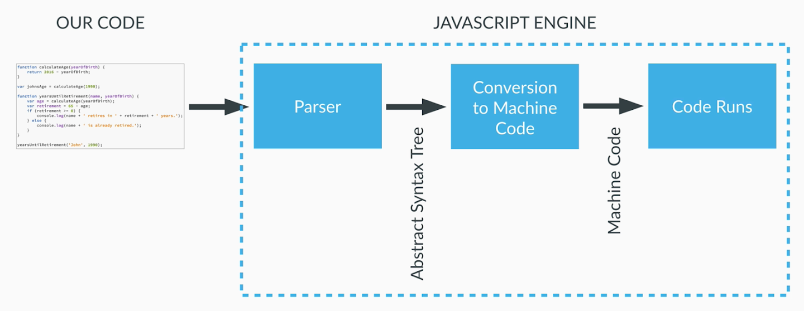
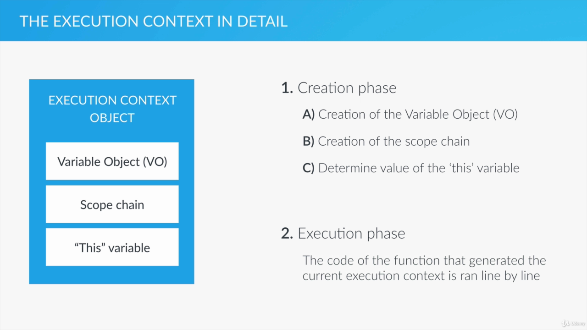
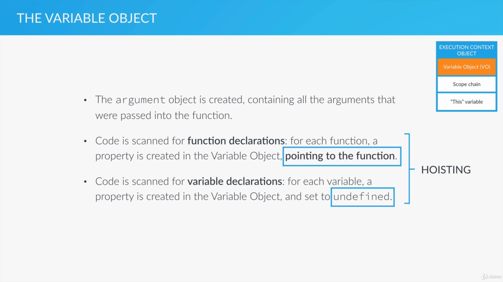
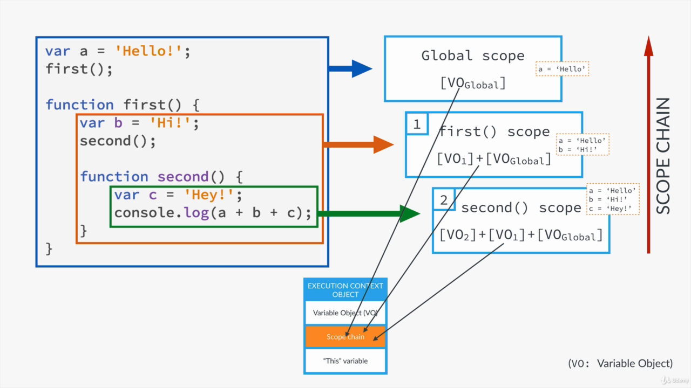
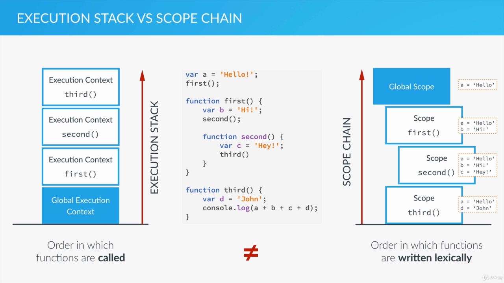
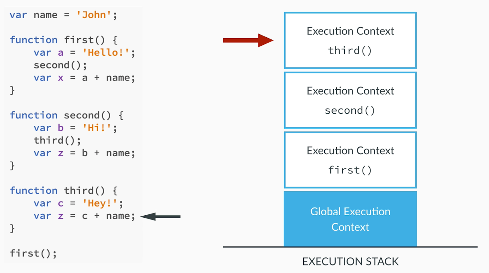

# JSBasics

**JavaScript** is lightweight, cross-platform, object-oriented computer programming language;

**JavaScript** is one of the three core technologies of web development;

Today **JavaScript** can be used in different places:

- **Client-side:** **JavaScript** was traditionaly only used in browser
- **Server-side:** Thanks to **Node.js**, we can use **JavaScript** on server as well

**JavaScript** is what made modern web development possible:

- Dynamic effects and interactivity
- Modern web applications that we can interact with

**Framework/Libraries** like **React** and **Angular** are 100% based on **JavaScript**: you need to master **JavaScript** in order to use them!

--------------------------------------------------

**HTML** -> Content
**CSS** -> Presentation
**JS** -> Dynamic Effects/Programming

--------------------------------------------------

## Variables

(var, let, const) - is a container in which we can store a value in order to use it over and over again in our code.

```javascript
var firstName = 'John';
var age = 23;
var isFullAge = true;
var job;
var cars = null;
```

### Primitive JavaScript Data Types

(JavaScript has dynamic typing: data types are automatically assigned to variables)

1. **Number:** Floating point numbers, for decimals and intergers
2. **String:** Sequence of characters, used for text
3. **Boolean:** Logical data type that can only be true or false
4. **Undefined:** Data type of variable that does not have a value yet
5. **Null:** Also means 'non-existent'

--------------------------------------------------

### Type coercion

JavaScript automaticaly converts one type of variable to another.

```javascript
console.log('Hello ' + 23);
//will become string "Hello 23"
```

### Variable mutation

 When you mutate a variable you are modifying the original value. An example of this would be to re-assign the `age` variable:

```javascript
var age = 23;
age = 'twenty three'; //now age is a String
```

--------------------------------------------------

## Comments

```javascript
//Comment

/*
Multiline comment
*/
```

--------------------------------------------------

## JavaScript Operators

- **Math Operators:**

    "-", "+", "*", "/", "="

- **Comparison Operators:**

  - ">"  -  greater than;
  - "<"  -  less than;
  - ">="  -  greater than or equall to;
  - "<="  -  less than or equall to;
  - "=="  -  equality;
  - "==="  -  strict equality;
  - "!="  -  inequality;
  - "!=="  -  strict inequality;
  
- **Logical Operators:**

  - "&&"  -  AND operator(true if ALL are true);
  - "||"  -  OR operator(true if ONE is true);
  - "!"  -  NOT operator(inverts true/false value);

- **Ternary operator** - JavaScript also contains a conditional operator that assigns a value to a variable based on some condition.

    ```javascript
    variablename = (condition) ? value1 : value2
    // where "?" is "if", ":" is "else"
    ```

- **Typeof Operator:**

    "typeof _something_"

--------------------------------------------------

### Operator precedence

determines how operators are parsed concerning each other. Operators with higher precedence become the operands of operators with lower precedence.

[MDN link](https://developer.mozilla.org/en-US/docs/Web/JavaScript/Reference/Operators/Operator_Precedence)

**Example**:

| Precedence | Operator type     | Associativity | Individual operators |
|------------|-------------------|---------------|----------------------|
|     18     | Postfix Increment |      n/a      |         … ++         |
|     15     |   Multiplication  | left-to-right |         … * …        |
|      3     |     Assignment    | right-to-left |         … = …        |

--------------------------------------------------

## Conditional Statements

- Use `if` to specify a block of code to be executed, if a specified condition is true;

  ```javascript
  if (condition) {
  //  block of code to be executed if the condition is true
  }
  ```
  
- Use `else` to specify a block of code to be executed, if the same condition is false;

  ```javascript
  if (condition) {
  //  block of code to be executed if the condition is true
  } else {
  //  block of code to be executed if the condition is false
  }
  ```

- Use `else if` to specify a new condition to test, if the first condition is false;

  ```javascript
  if (condition1) {
  //  block of code to be executed if condition1 is true
  } else if (condition2) {
  //  block of code to be executed if the condition1 is false and condition2 is true
  } else {
  //  block of code to be executed if the condition1 is false and condition2 is false
  }
  ```

- Use `switch` to specify many alternative blocks of code to be executed;

  ```javascript
  switch(expression) {
    case x:
       // code block
       break;
    case y:
       // code block
       break;
    default:
       // code block
  }
  ```

--------------------------------------------------

## Truthy and Falsy Values

- A **falsy** value is something which evaluates to FALSE, for instance when checking a variable. There are only six falsey values in JavaScript: `undefined`, `null`, `NaN`, `0`, `""` (empty string), and `false` of course.

```javascript
var string = ""; // <-- falsy

var filledString = "some string in here"; // <-- truthy

var zero = 0; // <-- falsy

var numberGreaterThanZero // <-- truthy

var emptyArray = []; // <-- truthy, we'll explore more about this next

var emptyObject = {}; // <-- truthy
```

- A **truthy** value is something which evaluates to TRUE. **Truthy** values are those that are NOT **falsy** values :)

--------------------------------------------------

## Functions

A JavaScript function is a block of code designed to perform a particular task, function is executed when "something" invokes it (calls it).

A JavaScript function is defined with the function keyword, followed by a name, followed by parentheses ().

Function names can contain letters, digits, underscores, and dollar signs (same rules as variables).

The parentheses may include parameter names separated by commas:
(parameter1, parameter2, ...)

The code to be executed, by the function, is placed inside curly brackets: {}

```javascript
function myFunction(p1, p2) {
  return p1 * p2;   // The function returns the product of p1 and p2
}

myFunction(2, 3); // function invocation (function call)
```

### Function Statement/Declaration

The **function** statement declares a function.
A declared **function** is “saved for later use”, and will be executed later, when it is invoked (called).
Just as **Variable Declarations** must start with “var”, **Function Declarations** must begin with “function”.

e.g.

```javascript
function bar() {
  return 3;
}
```

**function** is only declared here. For using it, it must be invoked using **function** name. e.g `bar()`;

### Function Expression

A JavaScript **function** can also be defined using an expression.
A **function expression** can be stored in a variable:

```javascript
var x = function (a, b) {
  return a * b
}
```

After a **function expression** has been stored in a variable, the variable can be used as a **function**. **Functions** stored in variables do not need **function** names. They are always invoked (called) using the variable name.

### Function Expression VS. Function Statement

**Function Expression**:

```javascript
alert(foo()); // ERROR! foo wasn't loaded yet
var foo = function() { return 5; }
```

**Function Declaration**:

```javascript
alert(foo()); // Alerts 5. Declarations are loaded before any code can run.
function foo() {
  return 5;
}
```

- **Function declarations** load before any code is executed while **Function expressions** load only when the interpreter reaches that line of code.
- Similar to the var statement, **function declarations** are hoisted to the top of other code. **Function expressions** aren’t hoisted, which allows them to retain a copy of the local variables from the scope where they were defined.

### Benefits of Function Expressions

There are several different ways that **function expressions** become more useful than function declarations.

- As closures
- As arguments to other functions
- As Immediately Invoked Function Expressions (IIFE)

--------------------------------------------------

## Arrays

JavaScript arrays are used to store multiple values in a single variable. An array is a special variable, which can hold more than one value at a time.

```javascript
var array_name = [item1, item2, ...];
//or
var array_name = new Array(item1, item2, ...)
```

--------------------------------------------------

## Objects

The **Object** class represents one of JavaScript's data types. It is used to store various keyed collections and more complex entities. **Objects** can be created using the `Object()` constructor or the object initializer / literal syntax.

- **Object literal**

```javascript
var object_name = {};
```

- **new Object syntax**

```javascript
var object_name = new Object();
```

### Object Properties

The `key:values` pairs in JavaScript **objects** are called properties:

```javascript
var person = {
firstName: 'John',
lastName: 'Smith',
age: 50,
isMarried: true
}
```

### Accessing Object Properties

You can access object properties in two ways:

```javascript
object_name.key
//or
object_name["key"]
```

### Object Methods

Objects can also have methods. Methods are actions that can be performed on objects. Methods are stored in properties as function definitions.

```javascript
var object_name = {
  key1: value1,
  key2: value2,
  key3: function() {return this.key1 + " " + this.key2;}
}
```

A method is a function stored as a property.
You access an object method with the following syntax:

```javascript
objectName.methodName();
```

### The **this** Keyword

In a function definition, `this` refers to the "owner" of the function.

In the example above, `this` is the `object_name` **object** that "owns" the `key3` function.

In other words, `this.key1` means the `key1` property of this **object**.

--------------------------------------------------

## Loops and Iterations

**JavaScript loops** are used to repeatedly run a block of code - until a certain condition is met. When developers talk about **iteration** or **iterating over**, say, an array, it is the same as **looping**. **JavaScript** offers several options to repeatedly run a block of code, including `while`, `do while`, `for` and `for-in`.

**JavaScript** supports different kinds of loops:

- `for` - loops through a block of code a number of times
- `for/in` - loops through the properties of an object
- `for/of` - loops through the values of an iterable object
- `while` - loops through a block of code while a specified condition is true
- `do/while` - also loops through a block of code while a specified condition is true.

### The For Loop

The most frequently used **loop** in **JavaScript** is the **for-loop**. The `for` loop has the following syntax:

```javascript
for (statement 1; statement 2; statement 3) {
  // code block to be executed
}
```

**Statement 1** is executed (one time) before the execution of the code block.

**Statement 2** defines the condition for executing the code block.

**Statement 3** is executed (every time) after the code block has been executed.

**Example**:

```javascript
for (i = 0; i < 5; i++) {
  console.log('Number ' + i); // 0, 1, 2, 3, 4
}
```

From the example above, you can read:

**Statement 1** sets a variable before the loop starts (var i = 0).

**Statement 2** defines the condition for the loop to run (i must be less than 5).

**Statement 3** increases a value (i++) each time the code block in the loop has been executed.

### The While Loop

The `while` **loop** loops through a block of code as long as a specified condition is true.

```javascript
while (condition) {
  // code block to be executed
}
```

**Example**:

In the following example, the code in the **loop** will run, over and over again, as long as a **variable** (i) is less than 10:

```javascript
while (i < 10) {
  console.log('Number ' + i);
  i++;
}
```

### The Do/While Loop

The `do/while` **loop** is a variant of the `while` **loop**. This loop will execute the code block once, before checking if the condition is true, then it will repeat the loop as long as the condition is true.

```javascript
do {
  // code block to be executed
}
while (condition);
```

**Example**:

The example below uses a `do/while` **loop**. The **loop** will always be executed at least once, even if the condition is false, because the code block is executed before the condition is tested:

```javascript
do {
  console.log('Number ' + i);
  i++;
}
while (i < 10);
```

### Break and Continue Statements

The `break` statement "jumps out" of a loop.

The `continue` statement "jumps over" one iteration in the loop.

#### The Break Statement

The `break` statement breaks the loop and continues executing the code after the loop (if any):

**Example**:

```javascript
for (i = 0; i < 10; i++) {
  if (i === 3)  break;
  console.log('Number ' + i);
}
```

#### The Continue Statement

The `continue` statement breaks one iteration (in the loop), if a specified condition occurs, and continues with the next iteration in the loop.

**Example**:

```javascript
for (i = 0; i < 10; i++) {
  if (i === 3)  continue;
  console.log('Number ' + i);
}

// This example skips the value of 3:
```

## Recursion

**Recursion** is when a function calls itself until someone stops it. If no one stops it then it'll recurse (call itself) forever.

Recursive functions let you perform a unit of work multiple times. This is exactly what for/while loops let us accomplish! Sometimes, however, recursive solutions are a more elegant approach to solving a problem.

**The three key features of recursion**
All recursive functions should have three key features:

**A Termination Condition**
Simply put: `if(something bad happened){ STOP };` The Termination Condition is our recursion fail-safe. Think of it like your emergency brake. It’s put there in case of bad input to prevent the recursion from ever running. In our factorial example, `if (x < 0) return;` is our termination condition. It’s not possible to factorial a negative number and thus, we don’t even want to run our recursion if a negative number is input.

**A Base Case**
Simply put: `if(this happens) { Yay! We're done };` The Base Case is similar to our termination condition in that it also stops our recursion. But remember, the termination condition is a catch-all for bad data. Whereas the base case is the goal of our recursive function. Base cases are usually within an if statement .In the factorial example, `if (x === 0) return 1;` is our base case. We know that once we’ve gotten x down to zero, we’ve succeeded in determining our factorial!

**The Recursion**
Simply put: Our function calling itself. In the factorial example, `return x * factorial(x — 1);` is where the recursion actually happens. We’re returning the value of the number x multiplied by the value of whatever factorial(x-1) evaluates to.

**All Three Together**
Now we still have no idea how our factorial example works, but ideally it makes more sense:

```javascript
function factorial(x) {
  // TERMINATION
  if (x < 0) return;
  // BASE
  if (x === 0) return 1;
  // RECURSION
  return x * factorial(x - 1);
}
factorial(3);
// 6
```

### How JavaScript Works Behind The Scenes



### Execution Context

**Execution Context** - is a box, a container, or a wrapper which stores variables and in which a piece of our code is evaluated. 
By default it is Global **Execution Context**:

- Code that is not inside any function

- Associated with the global object

- In the browser, that's the window object

```javascript
lastName === window.lastName
//true
```

We can associate **Execution Context** with an object.
**Execution Context Object** has three properties:

- Variable Object(VO) - contain **function arguments**, **inner variable declarations** and **function declarations**;

- Scope chain - contain current **variable objects** and **variable objects** of all it parents;

- "This" variable;

When **Function** is called, a new **Execution Context** is put on top of the **Execution Stack** and this happens in two phases:



If it's a **Global Context** than it's a **Global Code** that is executed.

### Creation of the Variable Object



**Functions** and **Variables** are HOISTED in JavaScript, which means that they are avaliable before the **Execution Phase** actually starts. **Functions** are already defined before the **Execution Phase** starts, while **Varibles** are setup to **Undefined** and will only be in the **Execution Phase**.

### Scope Chain

- **Scoping** answers the question "where can we access a certain variable?".
- **Each new function creates a scope**: the space/environment, in which the variables it defines are accessible.
- **Lexical scoping**: a function that is lexically within another function gets access to the scope of the outer function(parent function).




### 'This' variable

The 'This' is a variable that each and every **Execution Context** gets and is stored in **Execution Context Oblect**.

- **Regular function call**: the `this` keyword points at the global object(the window object in browser);
- **Method call**: the `this` variable points to the object that is calling the method;
- The `this` keyword is not assigned a value until a function where it is defined is actually called.

### Execution Stack

Last came, first goes.

